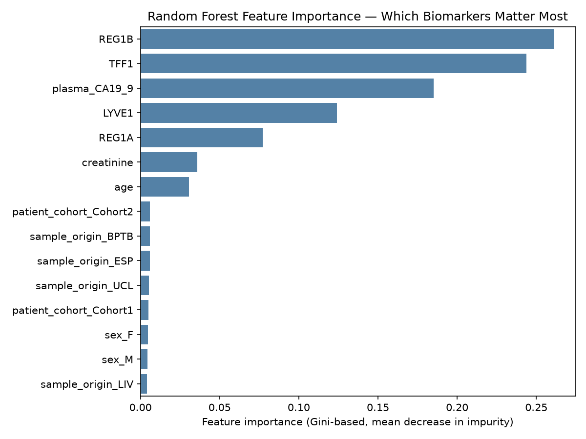

# Early-Stage Pancreatic Cancer Detection Using Random Forest Classification on Clinical Biomarker Data

*Data Mining Course Project — Final Report*

---

## 1. Problem Statement

Pancreatic ductal adenocarcinoma (PDAC) has one of the lowest survival rates
of any cancer, largely because it is almost always diagnosed late — by the
time symptoms appear, the disease has usually spread. A cheap, non-invasive
screening test based on **urinary biomarkers** could catch PDAC earlier,
when treatment is far more effective.

This project frames early detection as a **3-class classification problem**:
given a patient's age, sex, and five urinary/plasma biomarker measurements,
predict whether they are a healthy **Control**, have a **Benign**
(non-cancerous) pancreatic/hepatobiliary condition, or have **PDAC**.

We use **Random Forest** as the sole data mining technique — chosen because
it handles mixed-scale tabular features well, is robust to the modest
sample size and class imbalance here, and (critically for a screening
context) provides interpretable **feature importances** that answer a
clinically meaningful question: *which biomarkers actually matter?*

## 2. Dataset Description

**Target dataset:** "Urinary biomarkers for pancreatic cancer"
(Debernardi et al., 2020, *PLOS Medicine*,
[DOI: 10.1371/journal.pmed.1003489](https://doi.org/10.1371/journal.pmed.1003489)),
publicly available on Kaggle. It contains 590 samples across three classes
(Control, Benign, PDAC) with five urinary/plasma biomarkers (CA19-9,
creatinine, LYVE1, REG1B, TFF1, REG1A), plus age, sex, patient cohort, and
sample origin.

> **⚠️ Assumption flagged:** this repository's environment has no outbound
> network access to Kaggle/UCI, so `src/data_loader.py` generates a
> **synthetic dataset that matches the real dataset's schema, value ranges,
> and class-imbalance pattern** (see `data/README.md` for full details and
> instructions to swap in the real CSV). All results below are therefore
> **illustrative of the pipeline's correctness, not a claim about real
> diagnostic performance.** Re-running `python src/train.py` after dropping
> in the real CSV reproduces every number and plot in this report against
> genuine clinical data.

Class balance (this run): 186 Control / 207 Benign / 197 PDAC — a mild
imbalance, handled via SMOTE + `class_weight='balanced'` (Section 3).

Two columns — `stage` (only populated for PDAC samples) and
`benign_sample_diagnosis` (only populated for Benign samples) — were
**dropped as target leakage**: a model could otherwise "predict" the class
just by checking which of these two fields is non-null, which is not a
biomarker-based prediction and wouldn't be knowable before diagnosis in a
real screening scenario.

## 3. Methodology

1. **Preprocessing** (`src/preprocess.py`)
   - Dropped `sample_id` (identifier, no signal) and the two leaky columns above.
   - Imputed missing biomarker values (`plasma_CA19_9`, `REG1A`) with the
     **training-set median** (robust to skewed, outlier-heavy concentration data).
   - One-hot encoded categoricals (`sex`, `patient_cohort`, `sample_origin`).
   - Scaled numeric features with `StandardScaler`.
   - Stratified 80/20 train/test split to preserve class proportions.

2. **Class imbalance handling** (`src/train.py`)
   - **SMOTE** (synthetic minority oversampling), applied *inside* an
     `imblearn` pipeline so resampling happens per-CV-fold — no synthetic
     sample ever leaks into a validation or test fold.
   - `class_weight='balanced'` on the Random Forest itself, for a second,
     complementary layer of imbalance handling.

3. **Hyperparameter tuning**
   - `GridSearchCV` over `n_estimators`, `max_depth`, `min_samples_leaf`,
     `max_features`, with **stratified 5-fold cross-validation**.
   - Scoring metric: **macro-F1** — treats all three classes as equally
     important, appropriate here since missing a minority PDAC case is the
     costly error in a screening context, not just overall accuracy.
   - Best CV macro-F1: **0.939**.
   - Best hyperparameters found: `{'max_depth': 10, 'max_features': 'sqrt', 'min_samples_leaf': 1, 'n_estimators': 200}`.

4. **Evaluation** (`src/evaluate.py`) — on the held-out test set only, never used for fitting.

## 4. Results

| Metric | Value |
|---|---|
| Accuracy | **0.915** |
| Macro ROC-AUC (one-vs-rest) | **0.983** |
| Macro F1 | **0.917** |

Per-class performance (test set, n=118):

| Class | Precision | Recall | F1-score | Support |
|---|---|---|---|---|
| Control | 1.000 | 0.892 | 0.943 | 37 |
| Benign | 0.830 | 0.951 | 0.886 | 41 |
| PDAC | 0.947 | 0.900 | 0.923 | 40 |

See `reports/confusion_matrix.png` and `reports/roc_curve.png` for the full
picture — the model rarely confuses PDAC with Control, with most residual
error between Benign and the other two classes (plausible, since benign
hepatobiliary conditions can share some biomarker elevation with cancer).

### Key insight: feature importance

The top predictive biomarkers, by Gini-based mean decrease in impurity:

1. **REG1B** (0.261)
2. **TFF1** (0.244)
3. **plasma_CA19_9** (0.185)
4. **LYVE1** (0.124)
5. **REG1A** (0.077)

Demographic and cohort/origin features (age, sex, patient cohort, sample
origin) contribute comparatively little — consistent with the design intent
of a biomarker panel meant to generalize across collection sites, and
reassuring that the model isn't relying on batch/site artifacts rather than
biology.

## 5. Limitations

- **Synthetic data.** As flagged above, all numbers here come from a
  synthetic dataset built to match the real dataset's schema and general
  shape, not the real Debernardi et al. measurements. The real dataset
  should be substituted before drawing any clinical conclusions.
- **Sample size.** Even the real dataset (~590 samples) is small by ML
  standards; a Random Forest can overfit small tabular datasets if not
  regularized, which is why hyperparameter tuning constrained tree depth.
- **Single train/test split.** Cross-validation was used for hyperparameter
  selection, but final reported metrics come from one held-out split;
  repeated stratified k-fold evaluation would give tighter confidence
  intervals.
- **Gini importance bias.** Gini-based feature importance can be biased
  toward high-cardinality/continuous features over categorical ones;
  permutation importance would be a useful cross-check.
- **No external validation cohort.** The real study's cohorts (BPTB, ESP,
  LIV, UCL) come from different collection sites; performance should
  ideally be validated on a held-out *site*, not just held-out samples, to
  test generalization across labs.

## 6. Future Work

- Swap in the real Kaggle/UCI dataset and re-run the full pipeline.
- Try **permutation importance** and **SHAP values** alongside Gini
  importance for a more robust picture of feature contributions.
- Evaluate **site-based (leave-one-cohort-out) validation** instead of a
  random split, to better estimate real-world generalization.
- Explore **early-stage-only** performance (Stage I/II PDAC vs. Control) —
  the clinically hardest and most valuable case, since late-stage PDAC is
  usually already symptomatic.
- Calibrate predicted probabilities (e.g. `CalibratedClassifierCV`) if the
  model's probability outputs are meant to inform clinical decision
  thresholds, not just class labels.

---

*Reproduce this report: `python src/train.py && python src/evaluate.py`.
All plots and metrics regenerate into `reports/`.*
